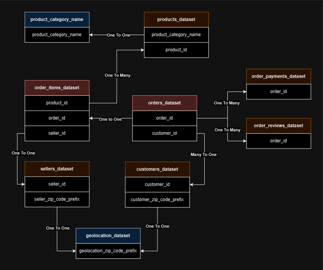
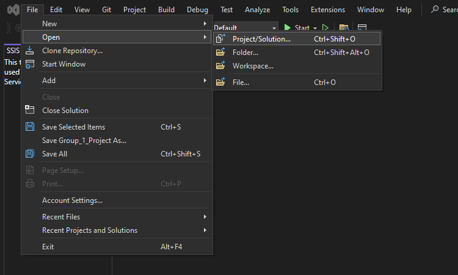
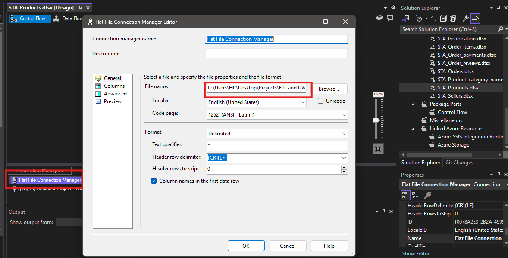
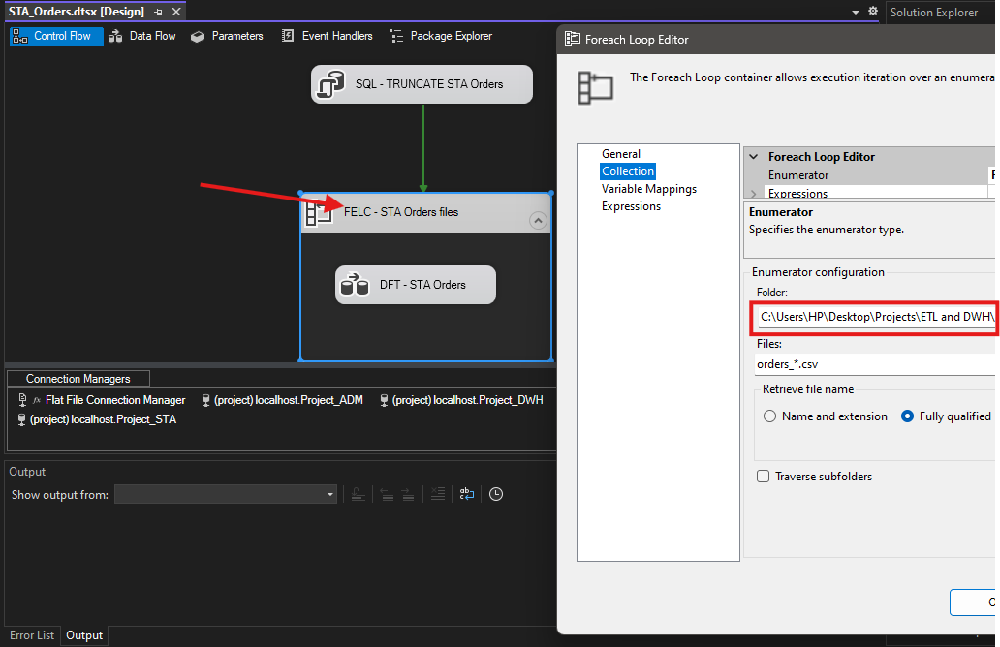
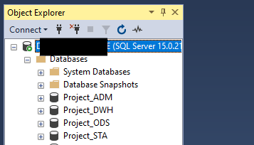
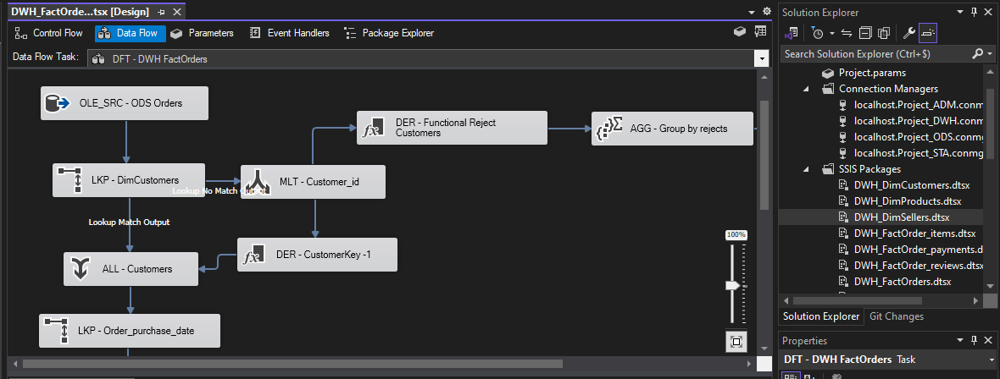
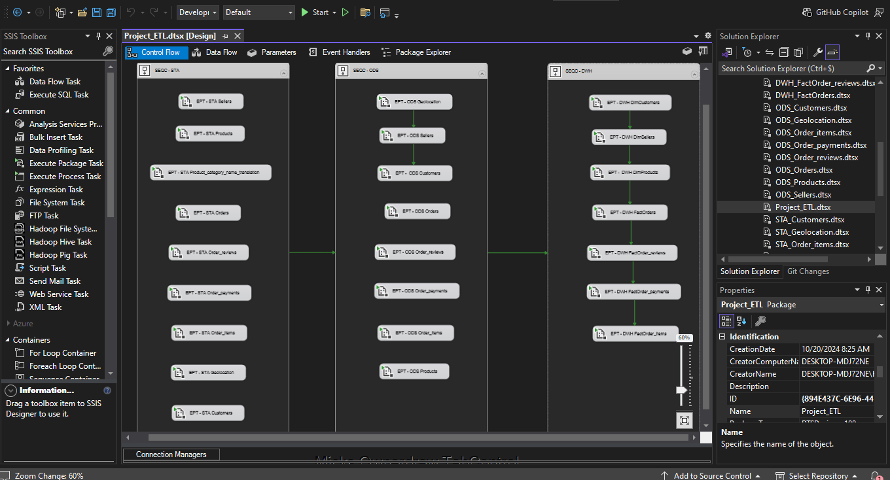
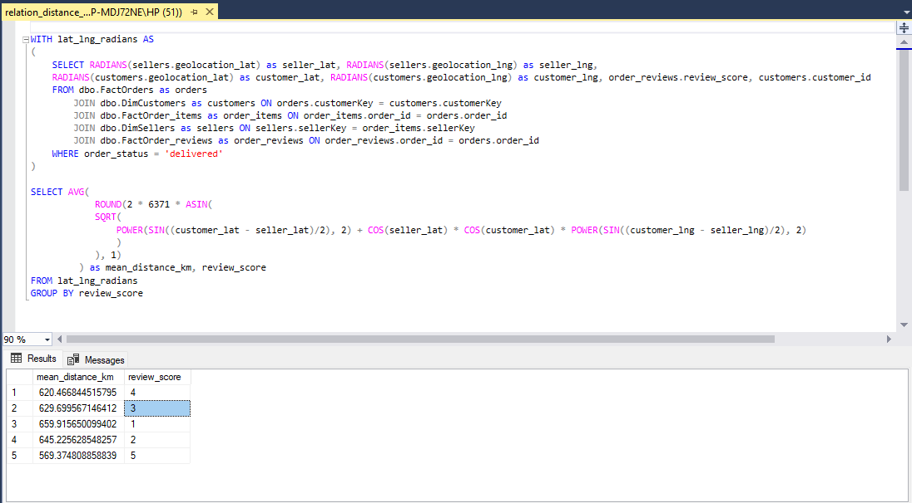

# ETL-EBusiness-data_SSIS
The complete data pipeline from extraction from source to loading in Datawarehouse of the Dataset of an E-Business, with SQL Server Integration Services (SSIS).

Find the detailed report [by clicking here](./report.pdf)

## The geniuses who worked with me 

[@lmdsti](https://github.com/lmdsti)

[@Michael Bruen](https://github.com/michaelbruen)

[@Theo-Ou](https://github.com/Theo-Ou)

[@yassineelh99](https://github.com/yassineelh99)

## Overview on the dataset

You can find the data dictionnary [by clicking here](./Data_Dictionary.pdf)

This is the data relationships and how they relate to each other

## Test the project

You need the SSIS package on visual studio and SQL server management studio installed to launch this project.

Import the folder 'project_files'

### Edit the dataset path in the flat file connection manager

After unziping the dataset 'DataSet.zip', edit the path of the flat file connection manager in the STA packages.

Example - STA Products

Example - STA Orders

### Create the database schemas (on sql server) on the same server

Import and execute the sql queries in the folder 'test-ETL_SqlQueries' to create the project's database schema

### Explore the dataflow of the different packages

Example DWH_Fact_Orders

### Execute the pipeline

The whole pipeline (Extraction, transformation, loading) can be executed by running the package Project_ETL.dtsx

### Get the analysis by executing the sql queries in the folder 'analysis_SqlQueries', against the Datawarehouse (Project_DWH)

Ex: distance between sellers and customers vs ratings 

You can try your own requests according to the analysis you would like to do !
